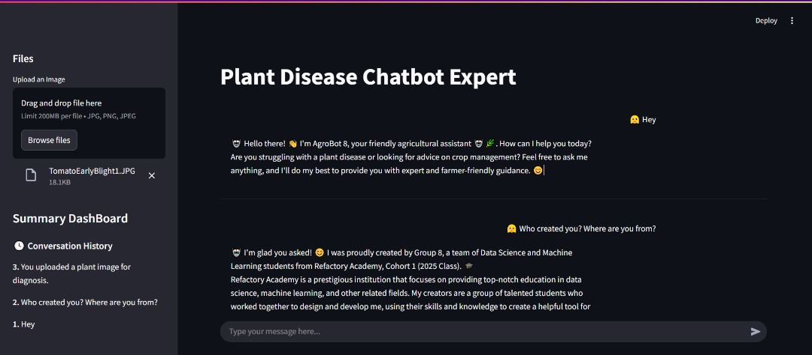
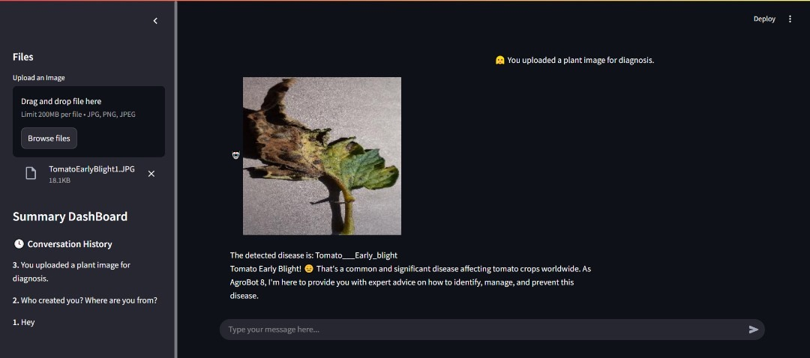
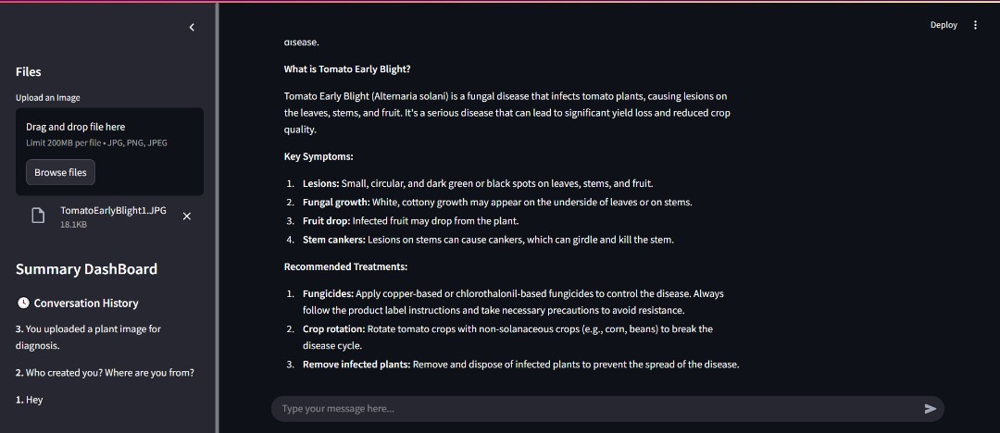
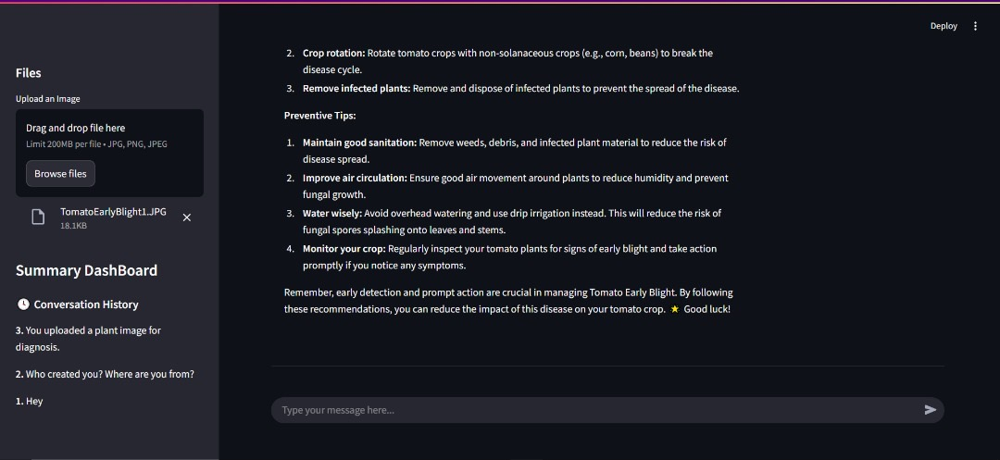

##  AgroBot: AI-Powered Plant Disease Assistant
AgroBot is a Generative AI-powered chatbot designed to assist farmers with plant disease diagnosis and treatment advice. Built with Streamlit, LangChain, Groq (LLaMA 3), and a custom-trained image classification model, AgroBot can:

1. Analyze uploaded leaf images for plant diseases

2. Retrieve expert advice using a RAG (Retrieval-Augmented Generation) pipeline

3. Answer agricultural questions in a simple, friendly, and emoji-enhanced style

## Preview

